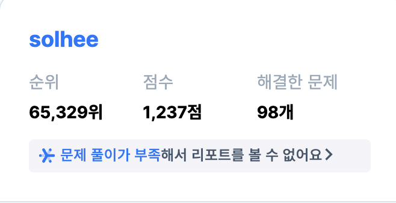

# 스터디원: 김설하

## 🚀 이번주 계획

지난주보다 이력서 집중하기

### 👾 코딩

- `화요일` AWS 강의 잘 듣고 정리해두기
- (😅) TodoList 완성하기
  - 문서 남기기 (2개 이상) (1/2)
- 코테 문제 하루 1시간 (Programmers / 시간 측정)

### 🪪 Cheer up

- `수요일` 서류 특강
- 사람인 / 원티드 포함 5곳 지원

### 💳 생계

- 단기알바 (2회)
- 일체험 인턴 지원 (개발무관 / 개발이면 Good)
- 무지출 데이 2일 / 하루 지출 10,000원 제한 (가계부 기록 중) ➡️ 무지출 1일 (0/1) + 하루 지출 10,000 제한 (1/6)
  > 단기알바 가끔 가면 좋은데 반려시즌이라 갈 수 있을지 모르겠다 못가는 날엔 본업에 집중  
  > 일체험 기술스택 + 거리 이슈로 일단 보류

### 🧘‍♀️ 자기계발

- 명상 하루 2회 챙겨서 하기 (0/6)
- 하루 1끼는 저속노화 식사
- 운동 주 3회 (0/3)

## ✅ 11/23 Todo List

- [x] 채용 공고 서칭
- [x] 지출 (10,000 제한)
- [ ] 코딩 기초 트레이닝 끝내기
- [ ] 현대 코테 접수 / 알고리즘 공부 계획
- [ ] AWS 강의 듣는 날

## 🎉 셀프 피드백

 격려하기</img>

> 잠은행에 빚져서 잡혀감 ㅠ  
> 늘어졌지만 채용공고 찾아보고 실질적으로 느끼는 게 좀 많아지지 않았나

 반성하기</img>

> 어제 늦게 자니까 하루가 짧음!

## 🌱 Next

- [ ] 코딩 기초 트레이닝 끝내기
- [ ] 현대 코테 접수 / 알고리즘 공부 계획
- [ ] AWS 강의 듣는 날
- [ ] 운동 (회고 끝나고 러닝 감 👟)
